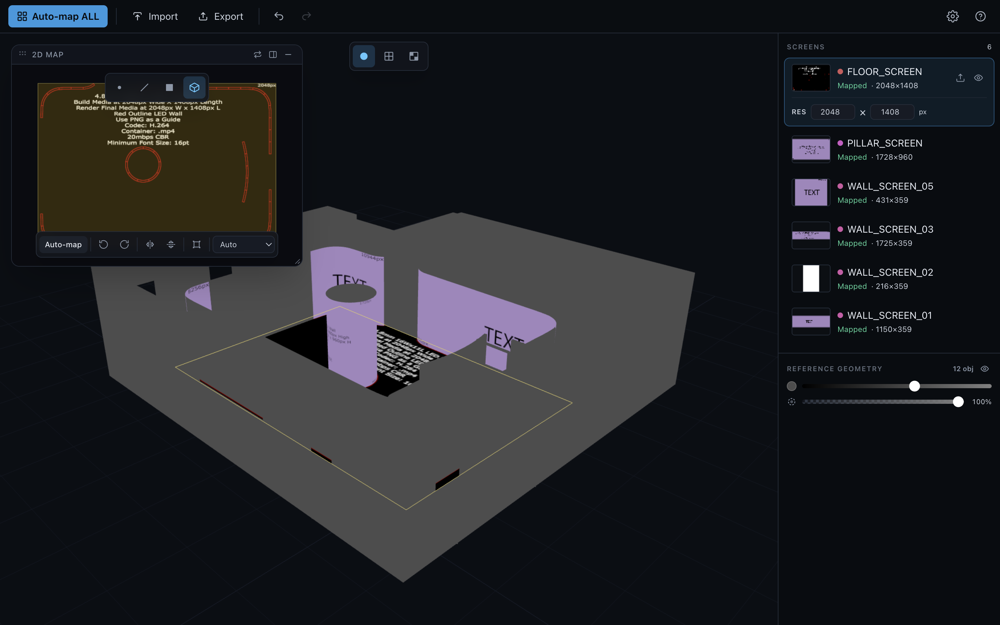

# UV Studio — screen mapping

A modern, maximally-automatic tool for mapping artwork onto **screens** in venue /
event 3D models — LED walls, floors, pillars, ribbon boards. A focused
reimagining of headus UVLayout, tailored for screen content, with one-click
round-trips to **Cinema 4D** and **Blender**.

<p align="center">
  
</p>

> 📖 **New here? Read the [User Guide](docs/GUIDE.md)** — a full, screenshot-led
> walkthrough of every feature. Or see it live at
> **[uv.preshow.link](https://uv.preshow.link)**.

## Get UV Studio

- **[uv.preshow.link](https://uv.preshow.link)** — the product site: download
  the signed macOS / Windows installer, or launch the browser build straight
  from there. (This repo's site is a small multi-page build: `/` is that
  marketing page, **[`/app/`](https://uv.preshow.link/app/)** is the actual
  tool, and **[`/help/`](https://uv.preshow.link/help/)** is the in-depth docs.)
- **Download directly:** grab the latest installer from
  **[Releases](https://github.com/hayhamLT/uvstudio/releases/latest)** —
  `.dmg` for macOS, `.exe` / `.msi` for Windows.
- **Use it online, no install:** **[uv.preshow.link/app](https://uv.preshow.link/app/)**
  (Chromium browsers — Chrome / Edge — for full file access).

The app auto-checks for updates on launch.

## What it does

- Import a multi-object **GLB / glTF** (each screen = a named object) together
  with its **PSDs / images** — a wizard links each layer to its screen by name.
  Or send a selection straight from **Cinema 4D / Blender**.
- Imports keep their **own UVs**; **auto-map is opt-in** (Auto-map ALL or
  per-screen) and fits each screen to its content. Per-screen rotate / flip /
  free-transform / unwrap projection (Auto / Planar / Cylindrical / Spherical,
  with auto seam-split for cylinders).
- The 2D view shows the **whole PSD with each screen's chunk** outlined; set the
  real **LED resolution** per screen.
- Export a **textured GLB** (carrying each screen's render size), or **Send back**
  to Cinema 4D / Blender.

## Cinema 4D & Blender bridges

The bridge is **zero-config** — both ends use a shared folder automatically, no
setup. Install the plugin / add-on from the app's **Preferences**.

- **Cinema 4D** — Extensions ▸ UV Studio Bridge ▸ **Send** (selected objects).
  Unwrap in UV Studio, then **Send back** → UVs land on the original objects'
  UVW tags, losslessly (geometry/materials untouched).
- **Blender** — enable the add-on once in Preferences ▸ Add-ons, then View3D ▸
  Sidebar (N) ▸ UV Studio ▸ **Send** (selected meshes). Unwrap, then **Send
  back** → UVs land on each object's active UV layer.

Only UV coordinates ever travel back — your geometry never round-trips.

## Part of the Toy Robot Media family

UV Studio is one of three sibling tools built by
[hamLT](https://motion.hamlt.com) and powered by
[Toy Robot Media](https://toyrobotmedia.com):

- **[Preshow.link](https://www.preshow.link)** — plan and previz real-world
  shows: venues, screens, timelines, review. UV Studio lives at
  [uv.preshow.link](https://uv.preshow.link) for a reason.
- **UV Studio** (this repo) — map artwork onto those screens, with C4D /
  Blender round-trips.
- **[PrevizRender](https://render.preshow.link)** —
  render comps locally: video mapped onto 3D scenes via headless Blender or
  Cinema 4D + Redshift.

A planned round-trip lets Preshow.link send a screens GLB here for UV work and
re-import it by object name (see `docs/toy-robot-family.md` in the
Preshow.link repo for the draft handoff spec).

---

## Build from source (developers)

```bash
npm install
npm run dev          # local dev server (Vite) — the tool is at http://localhost:5173/app/
npm test             # unit tests
npm run typecheck    # tsc

npm run tauri:dev    # desktop app (needs Rust — https://rustup.rs)
npm run tauri:build  # → installers in src-tauri/target/release/bundle/
npm run docs:shots   # regenerate docs/img/*.png (needs a running dev server)
```

> This is a small multi-page build: `/` is the static marketing site
> (`index.html`, plain HTML — no framework needed), `/app/` is the React tool
> (`app/index.html`), `/help/` is the static docs site (`public/help/`). All
> three ship from one `dist/`. `localhost:5173` is just the local dev server —
> it's not the shipped app. For the web build use a Chromium browser (the
> import pickers + link folder need the File System Access API).

Releases are cut by tagging: `git tag vX.Y.Z && git push origin vX.Y.Z` →
`desktop.yml` builds + publishes the Mac/Windows installers. macOS signing /
notarisation: see [`docs/SIGNING.md`](docs/SIGNING.md).

### How the bridge works

```
<link>/to_app/scene.json   C4D / Blender → UV Studio   (points + polys + guid)
<link>/to_c4d/scene.json   UV Studio → C4D / Blender   (UV only, per corner)
```

The forward sidecar carries each object's points + polygons + a stable guid (and
which DCC sent it); the return is **UV-only**, applied back onto the original
object by guid. Manifests are written atomically (temp + rename) so a reader
never sees a half-written file. The protocol is implemented four times against
the same layout: the **C4D plugin** & **Blender add-on** (Python), the **web app**
(File System Access API), and the **desktop app** (native Rust `fs`).

### Repo layout

```
src/                   React/Vite app (UI, unwrap engine, PSD handling)
  bridge/link.ts       link-folder bridge (web + desktop backends)
src-tauri/             Tauri v2 desktop shell (Rust bridge + plugin install)
c4d-plugin/            Cinema 4D plugin (.pyp) + README + IDS
blender-plugin/        Blender add-on (uvstudio_bridge.py) + README
docs/SIGNING.md        macOS signing + notarisation setup
.github/workflows/     ci.yml · web.yml · desktop.yml (installers)
DESKTOP.md             web vs desktop builds, bridge, CI details
```

### Tech

Vite · React 18 · TypeScript · Three.js / react-three-fiber · Zustand ·
Tailwind v4 · ag-psd · Tauri v2. Unwrapping: half-edge mesh, LSCM + ARAP relax,
planar / cylindrical / spherical projections.
