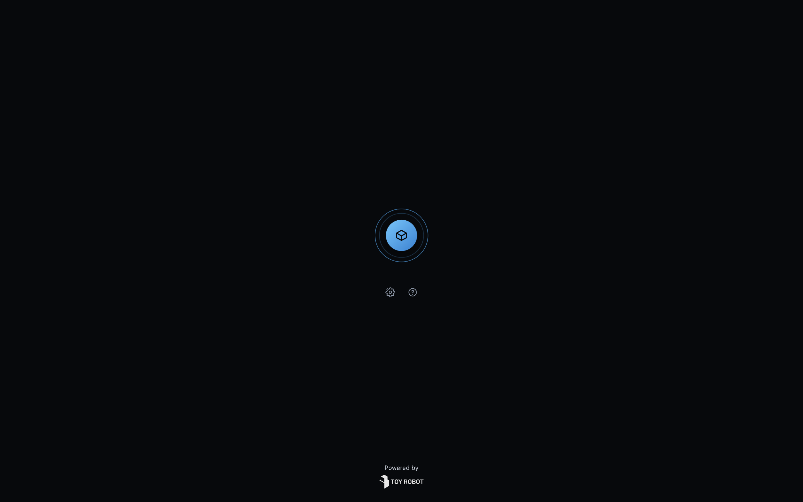
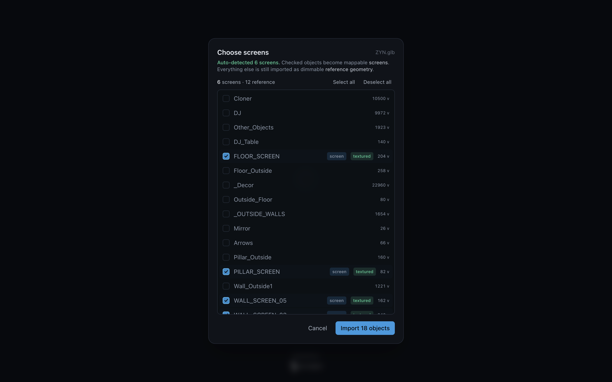
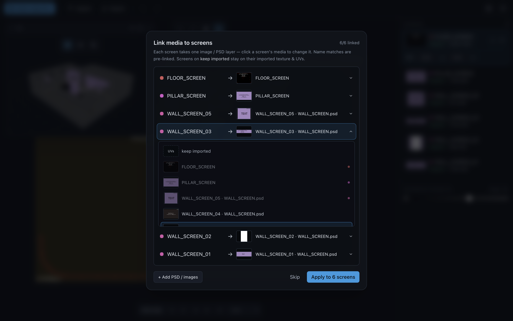
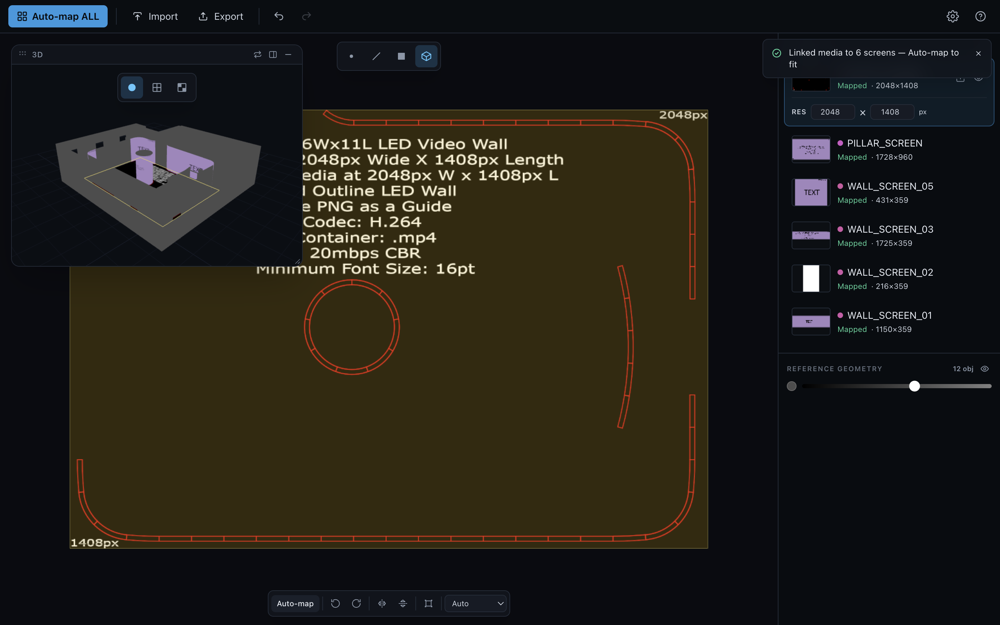

# UV Studio — User Guide

UV Studio maps your artwork onto the **screens** in a venue or event model — LED
walls, floors, pillars, ribbon boards — and sends the result straight back to
Cinema 4D or Blender (or out as a GLB). It does the fiddly UV work for you, so
you spend your time deciding *what goes where*, not wrestling with unwrapping.

This guide walks through the whole app, start to finish. If you just want the
30-second version: **bring a model in → link each screen to its artwork →
Auto-map → send it back.** That's the entire workflow.

- **Download (Mac / Windows):** [Releases](https://github.com/hayhamLT/uvstudio/releases/latest)
- **Use it online:** [uv.preshow.link](https://uv.preshow.link) (Chrome / Edge)

---

## 1. The launcher

When UV Studio opens you get a calm launcher, not a wall of panels. Click the
**orb** in the center to bring a model in. The two small icons beneath it are
**Preferences** (⚙, gear) and **Help** (?, question mark) — everything else
appears only once you've loaded something.

> On the desktop app the window stays compact here and grows automatically the
> moment a model loads.

---

## 2. Bringing screens in

There are two ways to get geometry into UV Studio.

### A. Import a model (GLB / glTF)

Click the orb (or **Import** in the top bar) and pick a `.glb` / `.gltf`. You can
select its **PSDs / images in the same dialog** — UV Studio keeps them together
and pre-links them for you in the next step.

UV Studio then asks which objects are **screens**:

- It **auto-detects** likely screens by name (anything ending in `SCREEN`, plus
  common patterns) and pre-checks them — see the green **screen** tags. A
  **textured** tag means that object already carries a texture in the file.
- **Checked objects become mappable screens.** Everything left unchecked is
  still imported, as dimmable **reference geometry** (the room, trusses, décor)
  so you keep your spatial context.
- Use **Select all / Deselect all**, or tick individual rows. The `… v` on the
  right is each object's vertex count, handy for spotting the heavy meshes.

Click **Import** and you're in.

### B. Send from Cinema 4D or Blender

If you're working in a 3D app, don't export by hand — use the bridge (see
[§9](#9-cinema-4d--blender-bridges)). Select your objects, hit **Send**, and they
open in UV Studio automatically. When you're done, **Send back** writes the UVs
straight onto your original objects.

---

## 3. Linking artwork to screens

This is the heart of the app. Each screen needs to know **which image (or PSD
layer) plays on it.**

Every screen gets a row: its **name on the left**, an **arrow**, and the
**media currently linked to it** shown as a thumbnail + label. Name matches are
linked for you automatically (that's why it often opens already `6/6 linked`).

**To change what's on a screen, click its row** — it expands into a list of every
imported image and PSD layer, each with a thumbnail so you can pick by *look*,
not by guessing at file names:

- The **"keep imported"** option (dashed *UVs* tile) leaves that screen on
  whatever texture/UVs it came in with — nothing changes.
- Selecting any tile links it. Links are **one-to-one**: if a layer is already on
  another screen, picking it moves it.

**A note on the colored dots** (a question people ask often):

- The **dot in front of a screen's name** is that screen's **identity color** —
  a stable color derived from its name. The same color marks the screen
  everywhere (list, wizard, outlines), so you can always tell which is which.
- A **dot at the end of a media option** means that media is **already linked to
  a different screen** — and the dot's color tells you *which* one (hover it for
  the name). It's just a heads-up before you steal it.

Use **+ Add PSD / images** to bring in more artwork mid-flow. When it looks
right, **Apply**. (Prefer to link later? **Skip** — you can attach media per
screen from the panel any time.)

---

## 4. The workspace

Once loaded, the screen fills with a **2D map view** and a floating **3D view**,
with the **Screens panel** on the right.

- **2D map** — the flat artwork with each screen's slice outlined, plus a pixel
  ruler (e.g. `2048px × 1408px`). This is where you nudge a screen's placement.
- **3D view** — your venue in space, screens lit with their content, reference
  geometry dimmed around them. Orbit to check coverage from the audience's seats.
- **Swap / dock / float** — the small icons on the floating window's title bar
  let you swap which view is primary, dock the second view into a split, or pop
  it out as a movable window. Press **Tab** to swap the two views instantly.

The **3D view mode** buttons (top center) switch how screens are shaded:
**Shaded** (real content), **Distortion** (stretch check), **Checker** (a grid to
spot squashing). Press **1 / 2 / 3** over the 3D view for the same.

---

## 5. The Screens panel

The right-hand panel is your screen list and control center.

Each row shows, at a glance:

- a **thumbnail** of what's actually landing on that screen (cropped to the exact
  slice of the artwork the screen samples — not the whole PSD);
- the **identity dot** + **name**;
- a **status** — `Mapped` (green) once it's fitted, `Not mapped`, or `No image`;
- the detected **resolution** (e.g. `2048×1408`).

**Select a screen** (click it here or in the 3D view) to expand its controls:

- **RES** — the render resolution UV Studio detected from the media. Overtype it
  with the screen's **real LED pixel size** if they differ; a small warning tells
  you when the applied media doesn't match.
- **Add / replace image** and **visibility** live on each row (hover to reveal).
  The eye control cycles **visible → solo → hidden** so you can isolate one
  screen while you work.

At the bottom, **Reference geometry** groups every non-screen object. The slider
sets how bright that context appears (black → 50% grey) and the eye hides it
entirely — dim it right down when you want the screens to pop, bring it up when
you need spatial reference.

---

## 6. Mapping

Imported screens keep **their own UVs** by default — nothing is auto-changed
under you. When you want UV Studio to fit artwork to screens, mapping is one
click:

- **Auto-map ALL** (top-left) fits **every** screen to its linked content.
- The **Auto-map** button in the 2D transform bar (or **M**) maps just the
  **selected** screen.

Rows pulse green as they're mapped, and a toast confirms the count.

### Per-screen adjustments (2D transform bar)

With a screen selected, the bar at the bottom of the 2D view gives you:

- **Rotate** CW / CCW · **Flip** horizontal / vertical
- **Free transform** — grab handles to scale, rotate, and move the artwork on the
  screen (press **T**)
- **Unwrap projection** — `Auto` keeps the imported UVs; `Planar`, `Cylindrical`,
  and `Spherical` re-project for curved or wrapped screens (cylinders get an
  automatic seam split).

On a narrow view the bar scrolls sideways rather than overflowing.

---

## 7. Sending it back / exporting

The action button in the top bar is **source-aware**:

- Screens that came **from Cinema 4D / Blender** → **Send back**. Only the UV
  coordinates travel back, landing on your original objects' UV tags/layers —
  **your geometry and materials are never touched.** UV Studio confirms with a
  toast (and tells you if any object couldn't be matched).
- A model you **imported as a file** → **Export** a textured **GLB** plus a small
  JSON sidecar carrying each screen's render size.

---

## 8. Notifications

UV Studio talks to you through **toasts** in the top-right — media linked,
mapping done, export saved, and the result of a Send. Success messages fade on
their own; warnings and errors linger (and pause if you hover them) so you don't
miss a screen that didn't map.

---

## 9. Cinema 4D & Blender bridges

The bridge is **zero-config** — both ends share a folder automatically, no setup.
Install the plugin / add-on once from the app's **Preferences**.

**Cinema 4D**
1. Preferences ▸ **Plugin** → Install, then restart Cinema 4D.
2. Extensions ▸ **UV Studio Bridge** ▸ **Send** (with your objects selected).
3. Map in UV Studio, then **Send back** → UVs land on the original UVW tags.

**Blender**
1. Preferences ▸ **Blender** → Install, then enable the add-on once in
   Blender ▸ Preferences ▸ Add-ons.
2. View3D ▸ Sidebar (**N**) ▸ **UV Studio** ▸ **Send** (selected meshes).
3. Map, then **Send back** → UVs land on each object's active UV layer.

Only UV coordinates ever travel back — geometry never round-trips, so there's
nothing to break on the way home.

---

## 10. Keyboard shortcuts

| Key | Action |
|---|---|
| **Tab** | Swap the 2D / 3D views |
| **1 / 2 / 3** | Over 3D: Shaded / Distortion / Checker |
| **B** | Toggle backface culling (3D) |
| **1 / 2 / 3 / 4** | In 2D: Vertex / Edge / Face / Object edit mode |
| **` / 0** | Leave edit mode |
| **M** | Auto-map the active screen |
| **T** | Free transform (⇧ non-uniform · ⌥ from corner) |
| **R / ⇧R** | Rotate CW / CCW |
| **F / ⇧F** | Flip horizontal / vertical |
| **S** | Interactive scale — move the mouse, click to set |
| **+ / −** | Scale up / down |
| **X** | Reset orientation |
| **⌘/Ctrl Z** | Undo ( ⇧ to redo ) |
| **Right-drag** | Pan the view · **Esc** clears selection |
| **H** | Toggle Help |

You can always open the in-app **Help** (the **?** icon, or **H**) for the
Workflow, Shortcuts, and Bridges tabs.

---

## 11. Updates

The desktop app checks for a newer version on launch and offers a one-click,
signed update. If you've installed a bridge plugin, UV Studio keeps it in step
with the app automatically and lets you know when to restart your 3D software.

---

## 12. FAQ

**A screen imported but shows "No image."** It has no linked media yet. Select it
and use **Add image**, drop a file on the 2D view, or re-open the link step.

**Auto-map said "0 mapped."** There was nothing to fit — link artwork to the
screens first, then Auto-map.

**My LED wall is a different pixel size than detected.** Overtype the **RES**
field on that screen with the true size; the export/send carries it through.

**Does anything change my geometry?** No. Round-trips send back **UVs only**.

**The whole room came in, not just the screens.** That's intended — unchecked
objects arrive as dimmable **reference geometry**. Dim or hide them from the
panel's Reference section.

---

*UV Studio — a focused, modern reimagining of headus UVLayout for screen content.
Built by [Toy Robot Media](http://www.toyrobotmedia.com/).*
